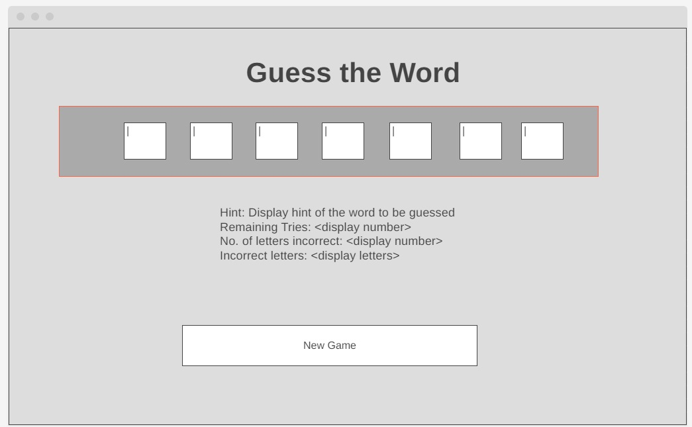

**Project - Guess the Word!**

**Project Flow Chart:**

**Project Specification:**

**Word Guessing Game**

In the Word guessing game, the user has to guess all the letters of a word generated on a
random basis. The word must be guessed within a specific number of tries.

**Specification:**

**Build a game of Guess word using Javascript**
There is a collection of words and the user has to guess the correct letter in a given word by the
hint displayed on the screen.
A game round would look like this:

● Page displayed with a hint of a random word with a maximum chances of 10

● User will guess a letter with the hint given - if it's a correct guess, the letter will be
displayed in the box.

● If the guessed letter in the random word displayed, then the letter would appear in the
word.

● If the guessed letter doesn’t consist of the random word, then your chances of guesses
would reduce.

● When tries are over you lose, if the guess is correct you win.

● Game will be reset for the next new word.

**Word Properties**

● Word must contain letters A-Z only

● Guess chances must be limited to the length of Random Word

● No.of tries to guess the word.

**Actor & Action**

Actors are users input.

Action - guess the word

**Wireframe:**

**Try here:**

https://mercygsk.github.io/Project-Guess-the-Word/
